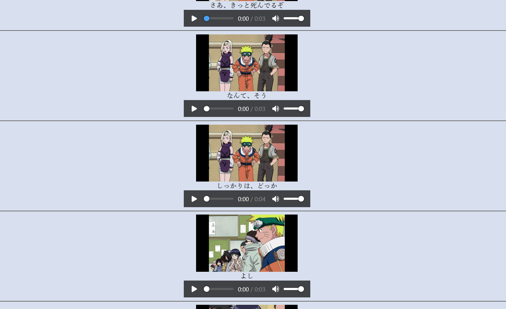

# Use
For Japanese language learning. If you have a video & the subtitles (currently only SRT format supported) in Japanese, this will create an HTML file with every subtitle and a screenshot in order so it can be read like a book. HTML is the current format because it then allows for easy use of any browsers' extensions.

# Instructions
Don't run in Anaconda because MeCab conflicts with Anaconda. This code adds furigana and uses the furigana python package.

### Recommended Extensions
In Chrome, I like to use Furigana Toggle & Vocab Tracker together.
Note: In chrome to enable files opened locally, go to Chrome->Extensions->Details->"Allow Access To File URLs". If this check box doesn't exist (Like w/ Furigana Toggle), go to the extensions' maifest.json and change permission to <all_urls>, then under Details->"Load Unpacked" and locate the extension folder.