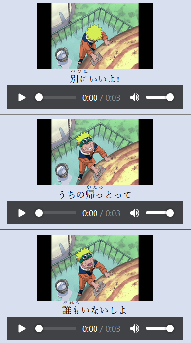

# SubStory: Multimedia Transcription and Visualization Tool
SubStory is a Python application that automatically transcribes audio from videos or audio files, and generates an interactive HTML document with synchronized audio, text, and images.
If you have a video , this will create an HTML file with every subtitle and a screenshot so it can be read like a book. HTML is the current format because it then allows for easy use of any browsers' extensions.
It also supports audio files if you want to transcribe a podcast for example.



## Table of Contents
1. [Dependencies](#Dependencies)
2. [Installation](#Installation)
3. [Usage](#Usage)
4. [Example](#Example)

## Dependencies
SubStory requires the following Python libraries:

- OpenCV (`cv2`)
- `os`
- `collections`
- `tqdm`
- OpenAI's Whisper ASR system (`whisper`)
- PyTorch (`torch`)
- MoviePy (`moviepy.editor`)
- `subprocess`
- `datetime`
- Yattag (`yattag`)
- `time`

## Installation
Assuming you have Python installed, you can use pip to install the dependencies:

```bash
pip install opencv-python-headless
pip install tqdm
pip install torch
pip install moviepy
pip install yattag
pip install furigana  # optional, if you want to add furigana to Japanese subtitles
```

## Usage
To use SubStory, import the class and create an instance. The `src_dir` parameter should be set to the directory where your input files are located. If you want to add furigana to Japanese subtitles, set `add_furigana=True`.

```python
from substory import SubStory

substory = SubStory(src_dir='Input', out_dir='Output', add_furigana=True)
```

Then, call the `process` method to start the transcription and visualization process:

```python
substory.process()
```

## Example
Assuming you have a directory `Input` with a video file `example.mp4` and an output directory `Output`:

```python
from substory import SubStory

substory = SubStory(src_dir='Input', out_dir='Output', add_furigana=True)
substory.process()
```

This will generate an interactive HTML document with subtitles, audio clips, and video frames for each subtitle in the video. The output will be located at `Output/example/example.html`.

## Code Explanation

The SubStory class accepts several parameters:

- `src_dir` : The source directory where your input files are located.
- `out_dir` : The output directory where the HTML files will be created.
- `add_furigana` : If set to True, the program will add furigana to Japanese subtitles.
- `width` : The width of the images in the HTML file.
- `track_number` : The audio track number to extract from the video file. By default, track number 0 is used.
- `verbose` : If set to True, the program will print progress messages.
- `language` : The language for transcription. If not specified, the language will be automatically detected.

The `process` method does the following:

1. For each file in the source directory, it checks if an audio file exists. If not, it extracts the audio from the video file.
2. If no subtitle file exists, it transcribes the audio using OpenAI's Whisper ASR system.
3. It generates an interactive HTML document with subtitles, audio clips, and video frames for each subtitle in the video.

Note: The audio transcription and language detection features require the OpenAI's Whisper ASR system, which as of my knowledge cutoff in September 2021 is not publicly available. The implementation may require modifications to work with the actual Whisper ASR API. Please refer to the official OpenAI documentation for details on the Whisper ASR API.

# Troubleshooting
If having issues try running outside of Anaconda because MeCab conflicts with Anaconda. This code adds furigana and uses the furigana python package.

### Recommended Extensions
In Chrome, I like to use Furigana Toggle & Vocab Tracker together.
Note: In chrome to enable files opened locally, go to Chrome->Extensions->Details->"Allow Access To File URLs". If this check box doesn't exist (Like w/ Furigana Toggle), go to the extensions' maifest.json and change permission to <all_urls>, then under Details->"Load Unpacked" and locate the extension folder.